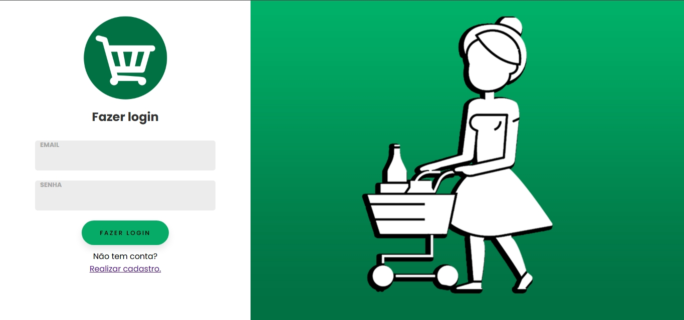
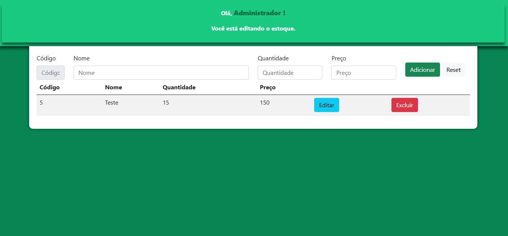

# PHP Projects

Este repositório contém projetos desenvolvidos durante meu aprendizado em PHP. Aqui, vou compartilhar códigos e sistemas que estou criando para praticar e aprimorar meus conhecimentos.

## Projetos

### 1. Sistema de Login e Gerenciamento de Estoque

O primeiro projeto deste repositório é um sistema que permite:

- Registro e login de usuários.

- Adição, edição e remoção de itens em um estoque.

- Integração com um banco de dados MySQL utilizando phpMyAdmin (XAMPP).

#### 📸 Imagens do Sistema
Tela de Login:  

Tela do Estoque:  

**Tecnologias Utilizadas**

- PHP: Linguagem principal do projeto.

- MySQL: Banco de dados para armazenamento das informações.

- XAMPP: Servidor local para desenvolvimento.

- HTML, CSS, JavaScript: Interface básica para interação com o usuário.

**Funcionalidades do Projeto**

- Sistema de autenticação de usuários (login e registro).

- Painel de controle para gerenciamento de itens do estoque.

